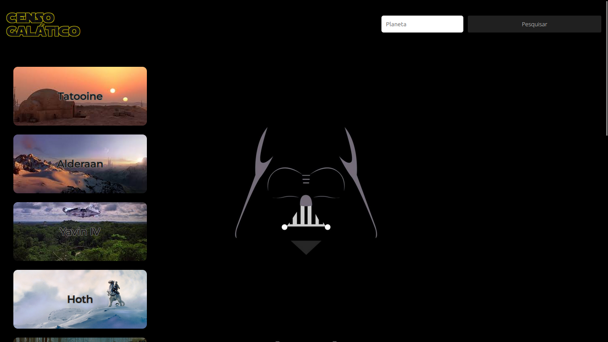
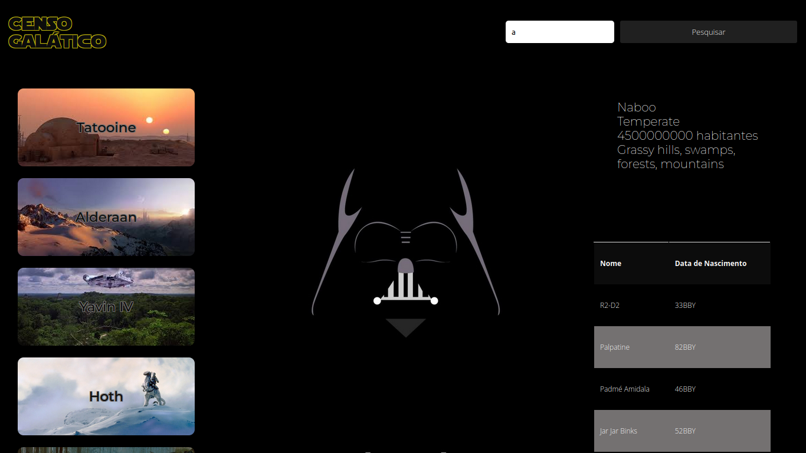
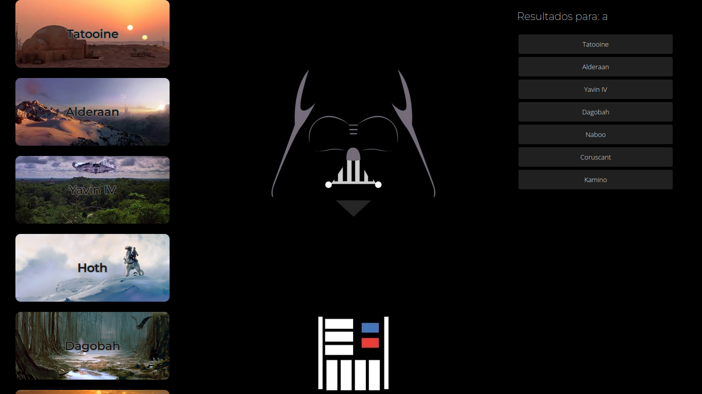
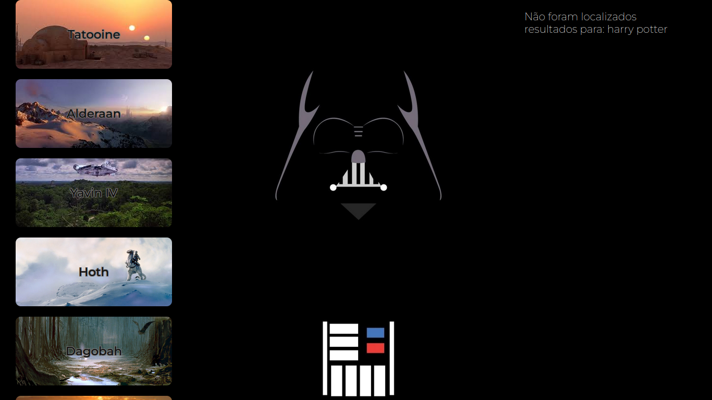

<h1>Censo Galático</h1>

<h2>Dependências</h2>
  <ol>
    <li> Para desktop:    
    Chrome;
    Edge;
    Firefox;
    IE;
    Opera;
    Safari.
    </li>
    <li>Para mobile: Firefox for Android;
    iOS Safari; Opera Mini; UC Browser for Android.</li>
  </ol>

<h2>Aplicação</h2>
<h3>Tela inicial</h3>

  
A aplicação conta com uma barra lateral com botões para seleção de planetas e um campo de busca localizado a barra superior.

Selecionando uns dos botões laterais serão exibido detalhes do planeta, como: Nome, Terreno, população, clima e um descrição com os habitantes mais notáveis.

Ao se realizar uma busca, serão localizados planetas com termo semelhante ao buscado e serão listado resultados próximos.

Clicar em qualquer botão listado irá resultar no detalhamento do planeta como visto anteriormente.

Caso a busca não retorne nenhuma equivalência, será repassado a mensagem de ausência de resultados:

